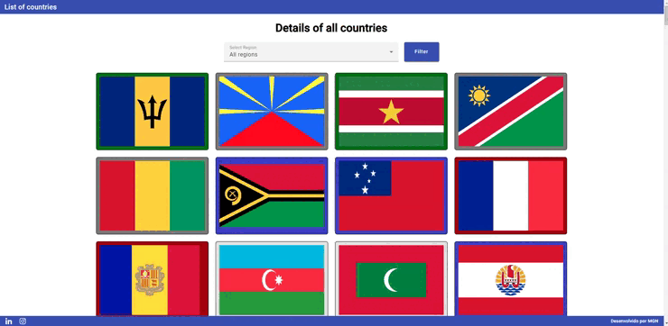

<h1 align="center">Countries | MGN </h1>

  <a href="#-tecnologias">Tecnologias</a>&nbsp;&nbsp;&nbsp;|&nbsp;&nbsp;&nbsp;
  <a href="#-projeto">Projeto</a>&nbsp;&nbsp;&nbsp;|&nbsp;&nbsp;&nbsp;
  <a href="#-redes">Redes</a>

---

  

---

## 🚀 Tecnologias

Esse projeto foi desenvolvido com as seguintes tecnologias:

- Angular
- Typescript
- Scss
- Angular Material

## 💻 Projeto

Esta aplicação é para prática de consumo da API [REST Countries](https://restcountries.com/) aonde é possível visualizar todas as bandeiras dos países do globo além de também ver detalhes como Nome, Região, Subregião e Capital do país sendo possível também filtrar por Região aonde aparecerá somente os países da Região filtrada.
É também possível ver a área territorial do país ao clicar no Maps que direciona para uma outra rota com a visualização via Google Maps da devida área territorial.

---

## 🔗 Redes

Estas são minhas redes sociais. Sinta-se a vontade para mandar uma mensagem.

- [Linkedin](https://www.linkedin.com/in/eomgn/)
- [Instagram](https://www.instagram.com/matheuzngr/)
- [Twitter](https://twitter.com/eomgn)